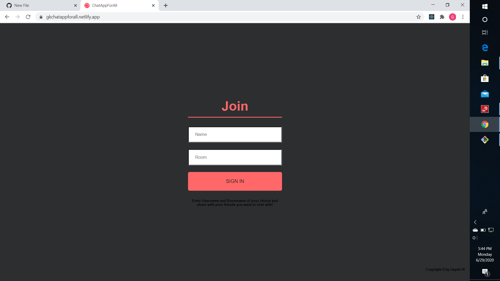
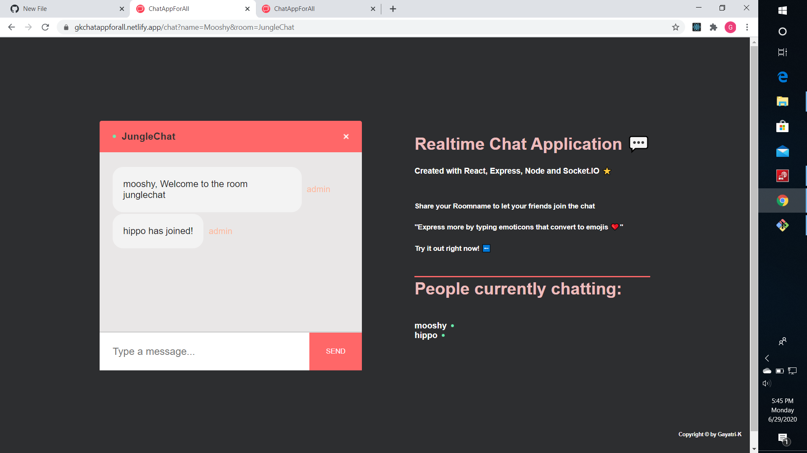
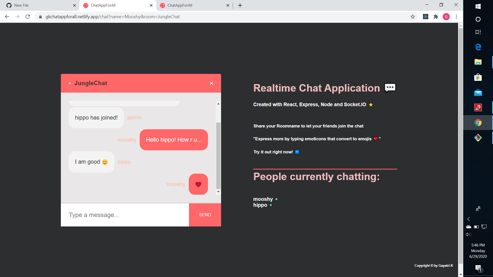
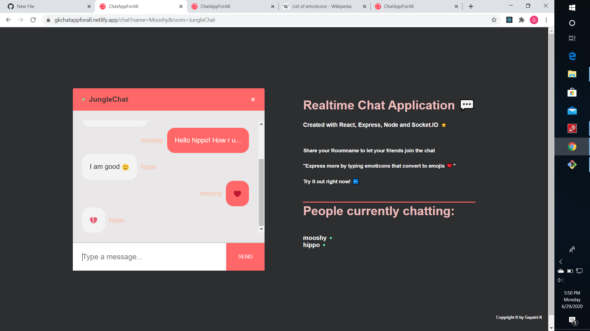
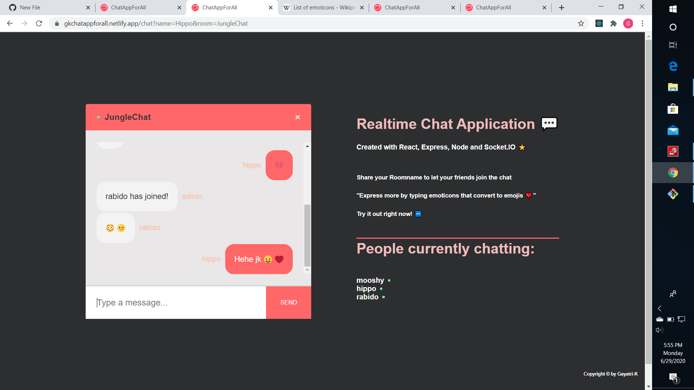

# Real-Time-Chat-App-using-React
*A fun Real-Time Chat Application developed using React, Express, Node and Socket.IO

*Share the App-Link and Room-Name with your friends and chat using texts and emoticons that convert to emojis while sent.
Added Scrollbar and and Down arrow button for better functionality.

  
 This is the App-Link...Try it now!
 <h1>https://gkchatappforall.netlify.app</h1>
 
<b>Snap Shots of a Live Chat Session:<b>

